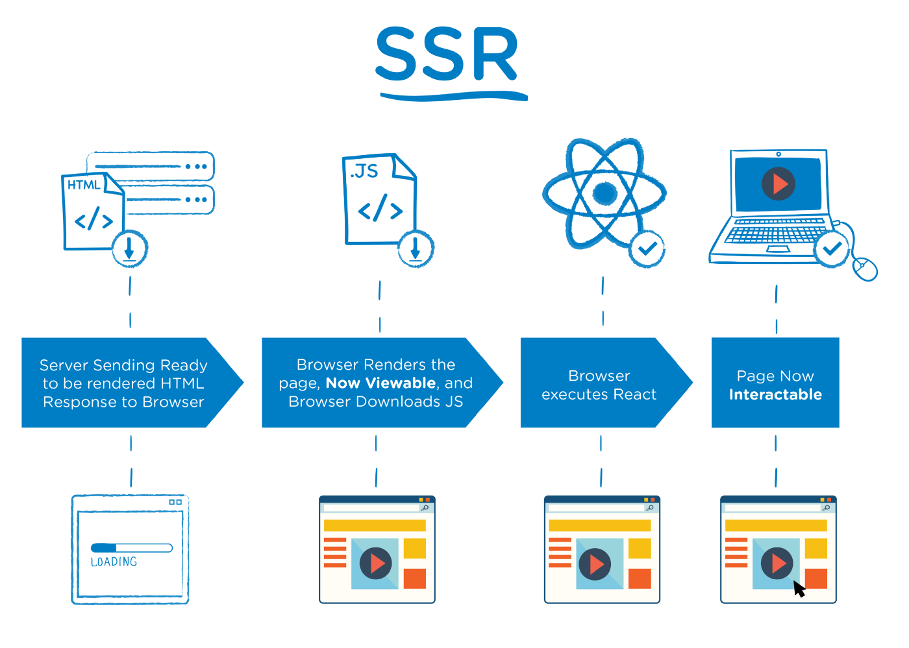
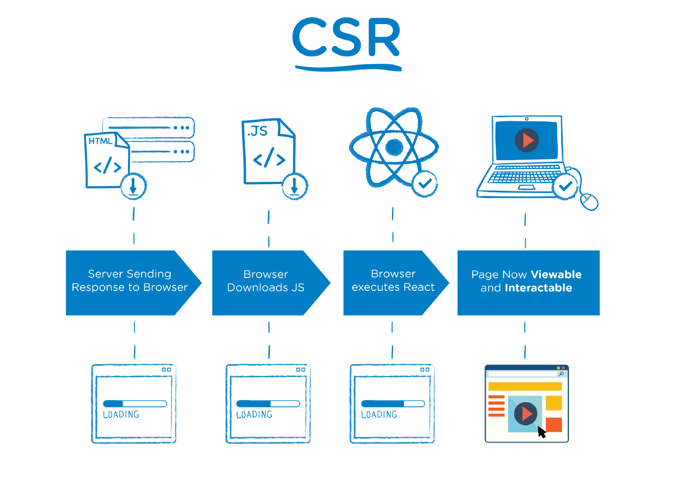

이 시리즈는 SPA기반 SSR의 개념과 동작 원리, 구현 방법을 다룹니다.
이런 개념과 동작 원리, 구현 방법을 상세히 알지 못하고 SSR 프레임워크를 사용시 구현과 버그 대응에 어려움을 겪을 수 있습니다. 
이를 공부함으로써 SPA기반 SSR 앱을 구현 시, 자신감 있게 구현할 수 있습니다. ~~(진짜...?!)~~

## SSR (Server-side Rendering) 이란?


출처: [The Benefits of Server Side Rendering Over Client Side Rendering](https://medium.com/walmartglobaltech/the-benefits-of-server-side-rendering-over-client-side-rendering-5d07ff2cefe8)

말 그대로 서버에서 렌더링을 합니다.

### 과정

1. **최초 요청 시**, 서버에서 사용자에게 **렌더링할 준비가 된 full HTML 파일**을 보내준다. <br/>
  서버가 이미 렌더링할 준비가 된 full HTML을 응답하기 때문에 사용자는 이때부터 의미있는(`Contentful`) 컨텐츠를 볼 수 있습니다.
    - Contentful HTML 예시 <br/>
      `<div id="root">`요소 내부가 SPA처럼 비어있는게 아닌, 의미있는 요소들로 채워져있습니다.

        ```html
        <!doctype html>
        <html lang="en">
            <head>
                <meta charset="UTF-8">
                <title>test-ssr</title>
                <style data-styled="true" data-styled-version="5.2.1">
                    .gEplBc {
                        background-color: #aaaaaa;
                        border: 1px solid blue;
                    }

                    /*!sc*/
                    data-styled.g1[id="App__Container-atnr6o-0"] {
                        content: "gEplBc,"
                    }

                    /*!sc*/
                </style>
            </head>
            <body>
                <div id="root">
                    <div class="App__Container-atnr6o-0 gEplBc">
                        <button data-page="home">Home</button>
                        <button data-page="about">About</button>
                        <div>
                            <h3>This is about page</h3>
                        </div>
                    </div>
                </div>
                <script src="/dist/main.23427ea2a2813f223cb6.js"></script>
            </body>
        </html>
        ```

2. 필요한 자원(JS, CSS...) 등을 다운로드 한다.
3. 브라우저에서 리액트를 실행한다. <br/>
  이 과정에서 최초 요청 시, 서버에서 사용자로부터 응답한 HTML 파일의 요소들을 리액트가 흡수(`hydration`)하여 리액트의 `Shadow DOM`을 만들어냅니다.
4. 위 과정이 모두 끝나면 유저는 컨텐츠를 볼 수 있을 뿐만 아니라, 인터랙티브하게 사용할 수 있다.

### 장점

- 유저가 유의미한 화면을 짧은 시간 내에 볼 수 있다.
- 서버의 응답이 full HTML이기 때문에 SEO에 더 유리. <br/>
~~(대형 서치 엔진들은 JS를 실행시켜서 생성된 컨텐츠를 확인한다고 합니다.)~~

### 단점

- 구현의 복잡성 <br/>
  아래 구현 과정에서 보실 수 있습니다. CSR보다 과정이 복잡하고 신경써야할 것들이 많습니다.
- 서버 성능을 많이 차지함 <br/>
  `SSR`구현 과정에서 쓰이는 `React.renderToString` api가 동기방식으로 CPU를 점유합니다. 즉 해당 api 실행시간이 한 번에 500ms가 걸린다면 서버는 1초당 두 번의 요청밖에 처리하지 못합니다.

## CSR (Client-side Rendering) 이란?


출처: [The Benefits of Server Side Rendering Over Client Side Rendering](https://medium.com/walmartglobaltech/the-benefits-of-server-side-rendering-over-client-side-rendering-5d07ff2cefe8)

SSR을 더 쉽게 이해하기 위해서 CSR을 간단하게 이해하고 넘어가겠습니다.

### 과정

1. **최초 요청 시,** 서버에서 사용자에게 **빈 HTML 파일**을 보내준다.
    - 예시

        ```html
        <!doctype html>
        <html lang="en">
            <head>
                <meta charset="utf-8"/>
                <link rel="icon" href="/favicon.ico"/>
                <meta name="viewport" content="width=device-width,initial-scale=1"/>
                <meta name="theme-color" content="#000000"/>
                <meta name="description" content="Creatrip admin site"/>
                <link rel="apple-touch-icon" href="/logo192.png"/>
                <link href="https://fonts.googleapis.com/css?family=Nanum+Gothic:400,700&display=swap&subset=korean" rel="stylesheet"/>
                <title>Admin | Creatrip</title>
                <link href="/static/css/2.101d5f7a.chunk.css" rel="stylesheet">
                <link href="/static/css/main.6b8af435.chunk.css" rel="stylesheet">
            </head>
            <body>
                <noscript>You need to enable JavaScript to run this app.</noscript>
                <div id="root"></div>
                <!-- ... -->
                <script src="/static/js/2.57f617cf.chunk.js"></script>
                <script src="/static/js/main.84842dc5.chunk.js"></script>
            </body>
        </html>
        ```

2. 필요한 자원(JS, CSS...) 등을 다운로드 한다.
3. 브라우저에서 리액트를 실행한다.
이때, 리액트는 빈 HTML문서를 채워넣을 DOM 요소를 만들어내 채운다.
4. 위 과정이 모두 끝나면 유저는 컨텐츠를 볼 수 있고, 인터랙티브하게 사용할 수 있다.

## SSR vs CSR 성능 비교

| 성능                          | SSR   | CSR |
| :--------------------------- | :---: | :---: |
| FCP (First Contentful Paint) | 승     | 패  |
| TTFB (Time To First Byte)    | 패     | 승  |
| TTI (Time To Interactive)    | 비등   | 비등 |

* SSR은 Contentful HTML을 최초 응답으로 보내고, CSR은 비어있는 HTML을 최초응답으로 보내기 때문에 FCP는 SSR이 우세합니다.
* SSR은 최초 응답까지 서버 사이드에서 렌더랑하는 시간이 소요되고, CSR은 정적 파일(HTML, CSS, JS 등)을 바로 응답하기 때문에 TTFB는 CSR이 우세합니다.
* TTI는 상황에 따라 달라집니다.
  SSR은 `hydration` 과정에서 부하가 일어나 `Interactive`해지는 시점이 늦춰질 수 있습니다.
  CSR 또한 컨텐츠를 위한 데이터 페칭등의 병목으로 인해 `Interactive`해지는 시점이 늦춰질 수 있습니다.

## 마무리
이번 편에서는 SPA기반 SSR에 대한 개념을 CSR과 비교하여 알아보았습니다.
다음 편부터는 SPA기반 SSR을 실제로 구현하는 것을 시작하겠습니다.
  

## 출처

- [어서와, SSR은 처임이지? - 도입 편](https://d2.naver.com/helloworld/7804182)
- [The Benefits of Server Side Rendering Over Client Side Rendering](https://medium.com/walmartglobaltech/the-benefits-of-server-side-rendering-over-client-side-rendering-5d07ff2cefe8)
- [Rendering on the Web](https://developers.google.com/web/updates/2019/02/rendering-on-the-web?hl=en)
- [Hydration and Server-side Rendering](https://blog.somewhatabstract.com/2020/03/16/hydration-and-server-side-rendering/)
