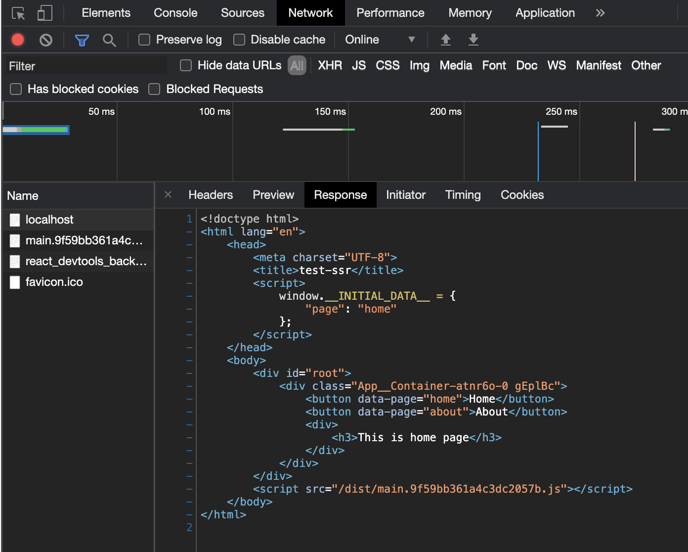

이번 편에서는 서버에서 클라이언트로 데이터를 전달하는 방법을 알아보고 구현하겠습니다.<br/>
서버에서 클라이언트로의 데이터 전달은 대표적으로 다음과 같은 곳에 쓰입니다.
1. CSS-in-JS 방식으로 스타일을 구현 시, SSR로 생성된 스타일을 전달
2. 서버 사이드에서 api 서버등과 같은 곳에서 받은 데이터를 전달

_해당 과정 중 많은 부분을 출처의 [실전 리액트 프로그래밍 (이재승 저)](https://medium.com/@ljs0705/%EC%8B%A4%EC%A0%84-%EB%A6%AC%EC%95%A1%ED%8A%B8-%ED%94%84%EB%A1%9C%EA%B7%B8%EB%9E%98%EB%B0%8D-%EA%B0%9C%EC%A0%95%ED%8C%90-%EC%86%8C%EC%8B%9D-d6d7a77e1c52)책을 참고하여 작성하였습니다._
_문제가 될 시 wnsgur6311@gmail.com으로 연락부탁드립니다._

### HTML에 서버 데이터 넣을 공간 만들기

서버에서 전달한 데이터를 클라이언트에 받기 위해서는 서버에서 데이터를 주입하고 담을 공간이 필요합니다.
이를 위해 html파일에 `window.__INITIAL_DATA__`라는 코드로 전역변수인 `window`에 `__INITIAL_DATA__`라는 프로퍼티를 만들어 서버에서 데이터를 담을 공간을 만듭니다.
`__DATA_FROM_SERVER__`는 서버 사이드 로직에서 문자열 치환(`replace`)를 통해 데이터를 주입하기 위해 필요합니다. 

- `template/index.html`

    ```html
    <!DOCTYPE html>
    <html lang="en">
    <head>
      <meta charset="UTF-8">
      <title>test-ssr</title>
      <script type="text/javascript">
        window.__INITIAL_DATA__ = __DATA_FROM_SERVER__; <!-- (1) -->
      </script>
    </head>
    <body>
      <div id="root"></div>
    </body>
    </html>
    ```

    - (1) `__DATA_FROM_SERVER__` 에 서버로부터 데이터를 주입받습니다.

### 서버에서 HTML에 데이터 넣기

서버에서 데이터를 주입할 공간을 만들었으니, 이제 서버에서 해당 공간에 데이터를 주입해보겠습니다.

- `src/server.js`

    ```jsx
    import express from 'express';
    import fs from 'fs';
    import path from 'path';
    import url from 'url';
    import { renderToString } from 'react-dom/server';
    import React from 'react';
    import App from './App';

    const app = express();
    const html = fs.readFileSync(
    	path.resolve(__dirname, '../dist/index.html'),
    	'utf8',
    );
    app.use('/dist', express.static('dist'));
    app.get('/favicon.ico', (req, res) => res.sendStatus(204));
    app.get('*', (req, res) => {
    	const parsedUrl = url.parse(req.url, true); // (1)
        const page = parsedUrl.pathname.substr(1) || 'home'; // (2)

    	const renderString = renderToString(<App page="home" />);
    	const initialData = { page };
        const result = html
          .replace('<div id="root"></div>', `<div id="root">${renderString}</div>`)
          .replace('__DATA_FROM_SERVER__', JSON.stringify(initialData)) // (3)
    	
    	res.send(result);
    });
    app.listen(3000);
    ```

    - (1) 요청 url을 파싱합니다.
    - (2) 파싱된 url로부터 page를 만듭니다. 클라이언트로 전달할 데이터입니다.
    - (3) HTML에 서버에서 생성한 데이터를 넣습니다.

### 클라이언트에서 서버에서 HTML에 주입한 데이터 사용하기

`index.js`파일에서 우리가 미리 만들어놓은 `window.__INITIAL_DATA__`에 담겨있는 데이터를 `initialData` 변수에 담습니다.
이 데이터를 `App`컴포넌트의 `page props`에 담아 결과를 확인합시다. 

- `src/index.js`

    ```jsx
    import React from 'react';
    import ReactDom from 'react-dom';
    import App from "./App";

    const initialData = window.__INITIAL_DATA__; // (1)
    ReactDom.hydrate(<App page={initialData.page} />, document.getElementById('root'));
    ```

    - (1) 전역객체인 window에서 우리가 미리 등록해놨던 `__INITIAL_DATA__` 를 가져옵니다.

### 실행확인
실행 명렁어를 실행하고 페이지에 접속하면 페이지의 url에 따라 `Home`과 `About` 페이지가 나오는 것을 확인할 수 있습니다.
#### 실행 명령어
```bash
  npm run build
  npm start
```
#### 결과
  

우리가 의도한대로 `__DATA_FROM_SERVER__`가 서버에서 생성한 데이터로 치환되었습니다.

## 마무리
지금까지 서버 데이터를 클라이언트로 전달하는 방법을 구현해보았습니다.<br/>
다음 편에서는 서버에서 스타일을 입히고, 해당 스타일을 클라이언트에서 그대로 유지하는 기능을 구현하겠습니다.

## 출처
- [실전 리액트 프로그래밍 (이재승 저)](https://medium.com/@ljs0705/%EC%8B%A4%EC%A0%84-%EB%A6%AC%EC%95%A1%ED%8A%B8-%ED%94%84%EB%A1%9C%EA%B7%B8%EB%9E%98%EB%B0%8D-%EA%B0%9C%EC%A0%95%ED%8C%90-%EC%86%8C%EC%8B%9D-d6d7a77e1c52)