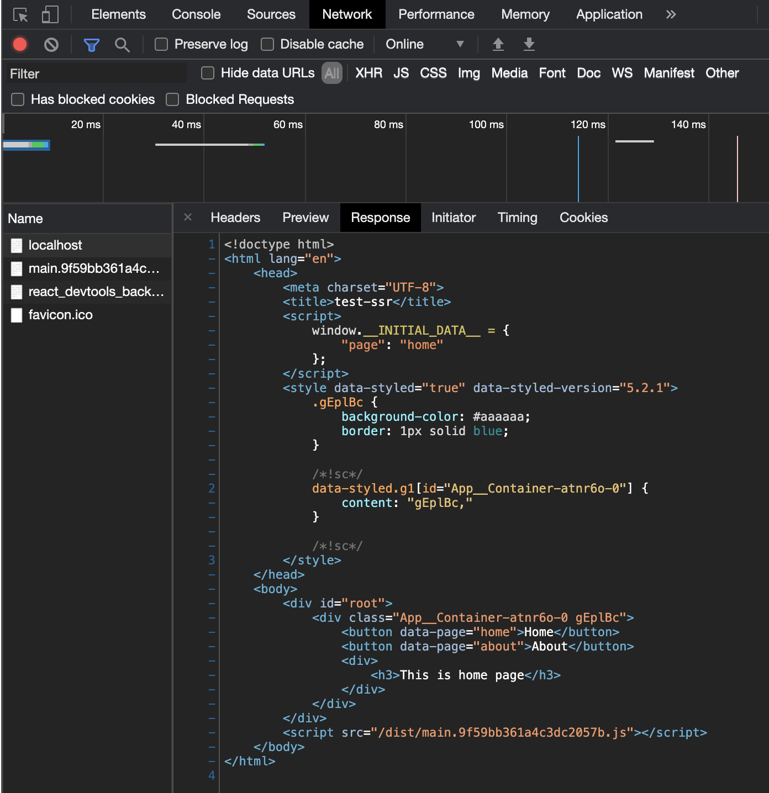

이번 편에서는 서버에서 응답하는 HTML 파일에 스타일을 적용하는 것을 구현하겠습니다.
React와 함께 자주 쓰이는 스타일링 방식인 `CSS-in-JS` 방식을 사용하겠습니다.
전통적인 CSS 방식으로 한다면 번들링 과정에서 HTML파일에 CSS파일을 주입해주면 될 것 같습니다.
~~webpack에 `css-loader` 설정하면 될 듯 싶습니다. (해보진 않았습니다.)~~

_해당 과정 중 많은 부분을 출처의 [실전 리액트 프로그래밍 (이재승 저)](https://medium.com/@ljs0705/%EC%8B%A4%EC%A0%84-%EB%A6%AC%EC%95%A1%ED%8A%B8-%ED%94%84%EB%A1%9C%EA%B7%B8%EB%9E%98%EB%B0%8D-%EA%B0%9C%EC%A0%95%ED%8C%90-%EC%86%8C%EC%8B%9D-d6d7a77e1c52)책을 참고하여 작성하였습니다._
_문제가 될 시 wnsgur6311@gmail.com으로 연락부탁드립니다._

<br/>

`CSS-in-JS` 라이브러리 중 저에게 가장 익숙한 `styled-components`를 사용하겠습니다.

### styled-components 설치 및 환경설정

SSR 환경에서 `styled-components`를 사용하기 위해서는 `babel-plugin-styled-components`라는 바벨 플러그인이 필요합니다.
이 플러그인은 여러가지 기능이 있지만, 그 중에서 서버 사이드에서 생성한 고유한 클래스이름이 클라이언트 사이드에서 불일치되는 일을 막아줍니다.

- 패키지 설치

    ```bash
    npm i styled-components
    npm i -D babel-plugin-styled-components
    ```

- 바벨 설정 - `.babelrc.common.js`

    ```jsx
    const presets = ['@babel/preset-react'];
    const plugins = ['babel-plugin-styled-components'];
    module.exports = { presets, plugins };
    ```

### 스타일 구현

간단한 스타일을 구현해줍니다.

- `src/App.js`

    ```jsx
    import React, { useState, useEffect } from 'react';
    import Home from "./Home";
    import About from "./About";

    const Container = styled.div`
      background-color: #aaaaaa;
      border: 1px solid blue;
    `

    function App({ page: initialPage }) {
      const [page, setPage] = useState(initialPage);

      useEffect(() => {
        window.onpopstate = event => {
          setPage(event.state);
        }
      },[]);

      function onChangePage(e) {
        const newPage = e.target.dataset.page;
        window.history.pushState(newPage, '', `/${newPage}`);
        setPage(newPage);
      };

      const PageComponent = page === 'home' ? Home : About;

      return (
        <Container>
          <button data-page="home" onClick={onChangePage}>
            Home
          </button>
          <button data-page="about" onClick={onChangePage}>
            About
          </button>
          <PageComponent />
        </Container>
      )
    }

    export default App;
    ```

### HTML에 서버에서 style 넣을 공간 만들기

[SPA기반 SSR 구현하기 (feat.React) 4-서버에서 클라이언트로 데이터 전달하기](https://milban.dev/SPA%EA%B8%B0%EB%B0%98%20SSR%20%EA%B5%AC%ED%98%84%ED%95%98%EA%B8%B0%20(feat.React)%204-%EC%84%9C%EB%B2%84%EC%97%90%EC%84%9C%20%ED%81%B4%EB%9D%BC%EC%9D%B4%EC%96%B8%ED%8A%B8%EB%A1%9C%20%EB%8D%B0%EC%9D%B4%ED%84%B0%20%EC%A0%84%EB%8B%AC%ED%95%98%EA%B8%B0)에서
구현한 것 처럼, 서버에서 생성된 스타일을 클라이언트로 전달하기 위한 공간을 `__STYLE_FROM_SERVER__`와 같이 만들어줍니다.

- `template/index.html`

    ```html
    <!DOCTYPE html>
    <html lang="en">
    <head>
      <meta charset="UTF-8">
      <title>test-ssr</title>
      <script type="text/javascript">
        window.__INITIAL_DATA__ = __DATA_FROM_SERVER__;
      </script>
      __STYLE_FROM_SERVER__
    </head>
    <body>
      <div id="root"></div>
    </body>
    </html>
    ```

### 서버에서 HTML에 스타일 넣기

이제 서버에서 렌더링 과정 중 생성된 스타일을 추출하고, 추출한 스타일을 HTML에 미리 마련한 공간인 `__STYLE_FROM_SERVER__`에 넣어줍니다.

- `./src/server.js`

    ```jsx
    import express from 'express';
    import fs from 'fs';
    import path from 'path';
    import url from 'url';
    import { renderToString } from 'react-dom/server';
    import React from 'react';
    import App from './App';
    import { ServerStyleSheet } from "styled-components";

    const app = express();
    const html = fs.readFileSync(
      path.resolve(__dirname, '../dist/index.html'),
      'utf-8',
    );
    app.use('/dist', express.static('dist'));
    app.get('/favicon.ico', (req, res) => res.sendStatus(204));
    app.get('*', (req, res) => {
      const parsedUrl = url.parse(req.url, true);
      const page = parsedUrl.pathname.substr(1) || 'home';
      const sheet = new ServerStyleSheet(); // (1)
      const renderString = renderToString(sheet.collectStyles(<App page={page} />)); // (2)
      const styles = sheet.getStyleTags(); // (3)

      const initialData = { page };
      const result = html
        .replace('<div id="root"></div>', `<div id="root">${renderString}</div>`)
        .replace('__DATA_FROM_SERVER__', JSON.stringify(initialData))
        .replace('__STYLE_FROM_SERVER__', styles); // (4)
      res.send(result);
    })
    app.listen(3000);
    ```

    - (1) 스타일을 추출한 객체를 생성합니다.
    - (2) `collectStyles` 메소드에 리액트 요소를 입력하여 스타일정보를 수집합니다.
      실제 스타일 정보는 `renderToSting` 함수의 호출이 끝나야 수집됩니다.
    - (3) `getStyledTags` 메서드를 호출하여 수집된 스타일정보를 가져옵니다.
    - (4) HTML에 스타일을 주입합니다.

### 실행확인

이제 실행시켜 정말 서버로부터 스타일이 잘 담겨오는지 확인하겠습니다.

#### 실행 명령어

```bash
  npm run build
  npm start
```

#### 결과
  

우리가 HTML에 미리 준비해놨던 `__STYLE_FROM_SERVER__`가 서버에서 생성된 스타일로 잘 주입되어 온 것을 확인할 수 있습니다.

## 마무리
여기까지 SSR 과정 중 스타일을 적용하는 방법을 구현했습니다. <br/>
다음편에서는 api 서버에서 데이터를 가져오고, 가져온 데이터를 컴포넌트에서 사용해 렌더링하는 방법을 알아보겠습니다.

## 출처
- [실전 리액트 프로그래밍 (이재승 저)](https://medium.com/@ljs0705/%EC%8B%A4%EC%A0%84-%EB%A6%AC%EC%95%A1%ED%8A%B8-%ED%94%84%EB%A1%9C%EA%B7%B8%EB%9E%98%EB%B0%8D-%EA%B0%9C%EC%A0%95%ED%8C%90-%EC%86%8C%EC%8B%9D-d6d7a77e1c52)