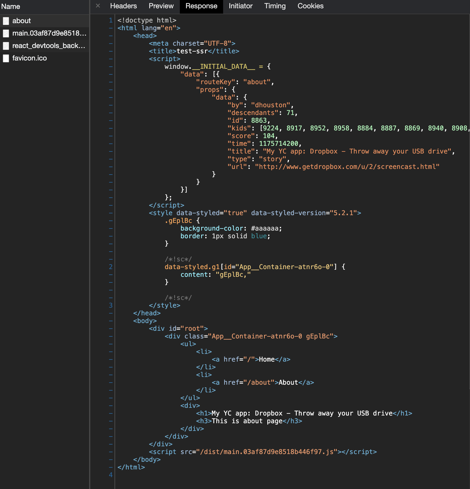

이번 편에서는 서버 사이드에서 api서버로부터의 데이터 페치를 실행한 후 해당 데이터를 사용하여 렌더링을 하는 방법을 구현하겠습니다.

### 패키지 설치

```bash
npm i axios react-router-dom
``` 

* `react-router-dom` <br/>
지금까지 HTML5의 `history api`를 사용해 라우팅을 구현하였지만, 이번편의 구현 과정에서 `react-router-dom`이 필요하기 때문에 사용합니다.

### App 컴포넌트, index.js에 React router dom 적용

- `src/App.js`

    ```jsx
    import React  from 'react';
    import Home from "./Home";
    import About from "./About";
    import styled from 'styled-components'
    import { Link, Switch, Route } from "react-router-dom";

    const Container = styled.div`
      background-color: #aaaaaa;
      border: 1px solid blue;
    `

    export const routes = [ // (1)
      {
        key: 'home',
        path: "/",
        component: Home,
        exact: true,
      },
      {
        key: 'about',
        path: "/about",
        component: About,
        exact: true,
      }
    ]

    export default function App() {
      return (
        <Container>
          <ul>
            <li>
              <Link to="/">Home</Link>
            </li>
            <li>
              <Link to="/about">About</Link>
            </li>
          </ul>
          <Switch>
            {routes.map(route => <Route key={route.key} {...route} />)}
          </Switch>
        </Container>
      )
    }
    ```
    - (1) 추후, 서버코드 작성 시, 서버에서 라우트 구조를 알아야하기 때문에 별도로 분리합니다.

<br/>  

- `src/index.js`

    ```jsx
    import React from 'react';
    import ReactDom from 'react-dom';
    import App from "./App";
    import {BrowserRouter} from "react-router-dom";

    const initialData = window.__INITIAL_DATA__;
    ReactDom.hydrate(
      <BrowserRouter>
         <App />
      </BrowserRouter>,
      document.getElementById('root')
    );
    ```

### About 컴포넌트에 서버 사이드 데이터 로딩을 위한 함수 작성

- `src/About.js`

    ```jsx
    import React from 'react';
    import axios from "axios";

    function About() {
      return (
        <div>
          <h3>This is about page</h3>
        </div>
      )
    }

    About.serverFetch = async () => { // (1)
      const res = await axios.get('https://hacker-news.firebaseio.com/v0/item/8863.json');
      return {
        routeKey: 'about',
        props: {
          data: res.data,
        }
      }
    }

    export default About;
    ```

    - (1) 서버에서 해당 함수를 사용해 데이터 로딩을 할 예정입니다.
  
해당 코드에서 컴포넌트 내부에 페치 함수를 작성하거나 `useEffect` 내부에 페치 함수를 작성하는 등의 방법으로 구현하지 않는지 의문을 가지실 수 있습니다.
컴포넌트 내부에 페치함수를 작성하지 않는 이유는 서버 사이드의 렌더링 실행 과정에서 비동기가 처리되지 않습니다.
또한 `useEffect`함수는 서버 사이드 렌더링 과정에서 실행되지 않습니다.

### 서버 사이드 데이터 페치 구현

- `src/server.js`

    ```jsx
    import express from 'express';
    import fs from 'fs';
    import path from 'path';
    import { renderToString } from 'react-dom/server';
    import React from 'react';
    import App, {routes} from './App';
    import { StaticRouter, matchPath } from 'react-router-dom'

    const app = express();
    const html = fs.readFileSync(
      path.resolve(__dirname, '../dist/index.html'),
      'utf8',
    );
    app.use('/dist', express.static('dist'));
    app.get('/favicon.ico',  (req, res) => res.sendStatus(204));
    app.get('*', async (req, res) => {
      const requiredServerFetch =
        routes
          .filter(route => matchPath(req.url, route)) // (1)
          .map(route => route.component) // (2)
          .filter(component => component.serverFetch) // (3)
          .map(component => component.serverFetch); // (4)
      const data = await Promise.all(requiredServerFetch.map(fetchFn => fetchFn())); // (5)
      const store = {
        data,
      } // (6)

      const renderString = renderToString(
          <StaticRouter location={req.url} context={{}}>
            <App />
          </StaticRouter>
      );
      const result = html.replace(
        '<div id="root"></div>',
        `<div id="root">${renderString}</div>`,
      ).replace('__DATA_FROM_SERVER__', JSON.stringify(store)); // (7)
      res.send(result);
    });
    app.listen(3000);
    ```
* (1) `react-router-dom`의 [matchPath api](https://reactrouter.com/web/api/matchPath)와
  `src/App.js`에 작성해놓았던 `routes` 배열을 이용해 현재 url에 매치되는 객체를 가져옵니다.
* (2) 매치된 객체에서 `component`를 가져옵니다.
* (3) `serverFetch` 메소드가 존재하는 `component`만 가져옵니다.
* (4) `serverFetch` 메소드를 가져옵니다.
* (5) 선별된 `fetch`를 위한 함수들을 실행시킵니다.
* (6) 페치된 데이터들을 담습니다.
* (7) HTML에 미리 준비된 `__DATA_FROM_SERVER__`를 우리가 페치한 데이터로 치환합니다.


### 서버 사이드의 데이터를 컴포넌트로 주입해주기

현재는 서버 사이드에서 페치된 데이터가 클라이언트 사이드로 전달됐을 뿐, 해당 데이터를 사용하여 렌더링하지 않았습니다.
페치된 데이터를 사용하여 렌더링해보겠습니다.

#### PreloadContext 생성

페치된 데이터를 렌더링 과정에서 사용하기 위해서는 컴포넌트에서 페치된 데이터를 사용할 수 있어야합니다.
이를 위해 모든 컴포넌트에서 접근할 수 있는 전역 스토어를 만들어 제공하겠습니다.<br/>
전역 스토어는 React의 `context api`를 사용하겠습니다.

- `/src/lib/PreloadContext.js`

    ```jsx
    import {createContext} from "react";

    const PreloadContext = createContext(null);
    export default PreloadContext;
    ```

#### 서버에서 PreloadContext를 이용하여 데이터 주입

  ```jsx
  import express from 'express';
  import fs from 'fs';
  import path from 'path';
  import { renderToString } from 'react-dom/server';
  import React from 'react';
  import App, {routes} from './App';
  import {ServerStyleSheet} from "styled-components";
  import { StaticRouter, matchPath } from 'react-router-dom'
  import PreloadContext from './lib/PreloadContext';

  const app = express();
  const html = fs.readFileSync(
    path.resolve(__dirname, '../dist/index.html'),
    'utf-8',
  );
  app.use('/dist', express.static('dist'));
  app.get('/favicon.ico', (req, res) => res.sendStatus(204));
  app.get('*', async (req, res) => {
    const requiredServerFetch =
      routes
        .filter(route => matchPath(req.url, route))
        .map(route => route.component)
        .filter(component => component.serverFetch)
        .map(component => component.serverFetch);
    const data = await Promise.all(requiredServerFetch.map(fetch => fetch()));
    const store = {
      data,
    }

    const sheet = new ServerStyleSheet();
    const renderString = renderToString(
      sheet.collectStyles(
        <StaticRouter location={req.url} context={{}}>
          <PreloadContext.Provider value={store} > // (1)
            <App />
          </PreloadContext.Provider>
        </StaticRouter>
      )
    );
    const styles = sheet.getStyleTags();
    const result = html
      .replace('<div id="root"></div>', `<div id="root">${renderString}</div>`)
      .replace(
        '__DATA_FROM_SERVER__',
        JSON.stringify(store)
      )
      .replace('__STYLE_FROM_SERVER__', styles);
    res.send(result);
  })
  app.listen(3000);
  ```

* (1) 서버 사이드 렌더링 과정에서 우리가 만들어둔 `PreloadContext` 스토어에 페치된 데이터를 넣어 컴포넌트에서 데이터를 사용할 수 있게 합니다.

#### About 컴포넌트에서 PreloadContext를 사용해 주입된 데이터 사용하기

- `/src/About.js`

  ```jsx
    import React, { useEffect, useState, useContext } from 'react';
    import axios from "axios";
    import PreloadContext from "./lib/PreloadContext";
  
    function About() {
      const preloadedData = useContext(PreloadContext);
      const [data, setData] = useState(
            preloadedData
              .data
              .find(item => item.routeKey === 'about').props.data);
  
      return (
        <div>
          <h1>{data && data.title}</h1>
          <h3>This is about page</h3>
        </div>
      )
    }
  
    About.serverFetch = async () => {
      const res = await axios.get('https://hacker-news.firebaseio.com/v0/item/8863.json');
      return {
        routeKey: 'about',
        props: {
          data: res.data,
        }
      }
    }
  
    export default About;
  ```

### 실행 확인
실행해보면 결과처럼 `/about`으로 접속 시, 서버에서의 응답 HTML파일에 페치된 데이터가 주입되어 있는 것과 페치된 데이터가 컴포넌트에서 사용돼 렌더링 된 것을 확인할 수 있습니다.


실행 시, 클라이언트 사이드에서 에러가 발생해 흰 화면이 보이는 것은 정상입니다.
이는 아직 서버사이드에서 전달한 데이터를 클라이언트 사이드에서 컴폰넌트가 사용할 수 있게 제공하는 로직을 작성하지 않았기 때문에 발생하는 에러입니다.
다음편에서 해결할 에러이니 서버 응답 HTML파일이 정상적으로 왔는지가 중요합니다.

#### 실행 명령어

  ```bash
  npm run build
  npm start
  ```

#### 결과

  

## 마무리
지금까지 
`(1) 서버사이드에서 api서버를 통한 데이터 페치를 하는 방법`,
`(2) 페치된 데이터를 클라이언트 사이드에 전달하는 방법`,
`(3) 페치된 데이터를 컴포넌트에서 사용할 수 있게 하는 방법` 을 알아보고 구현했습니다.<br/>

SPA기반 SSR 구현하기 마지막 편인 다음편에서는 클라이언트 사이드로 전달한 데이터를 클라이언트 스토어로 `Hydration`하는 방법에 대해 알아보고 구현하겠습니다.

## 출처
- [Demystifying server-side rendering in React](https://www.freecodecamp.org/news/demystifying-reacts-server-side-render-de335d408fe4/)
- [React Router DOM - server-rendering](https://reactrouter.com/web/guides/server-rendering)
- [리액트를 다루는 기술 (김민준 저)](https://velog.io/@velopert/%EB%A6%AC%EC%95%A1%ED%8A%B8%EB%A5%BC-%EB%8B%A4%EB%A3%A8%EB%8A%94-%EA%B8%B0%EC%88%A0-%EA%B0%9C%EC%A0%95%ED%8C%90-%EC%B6%9C%EA%B0%84)