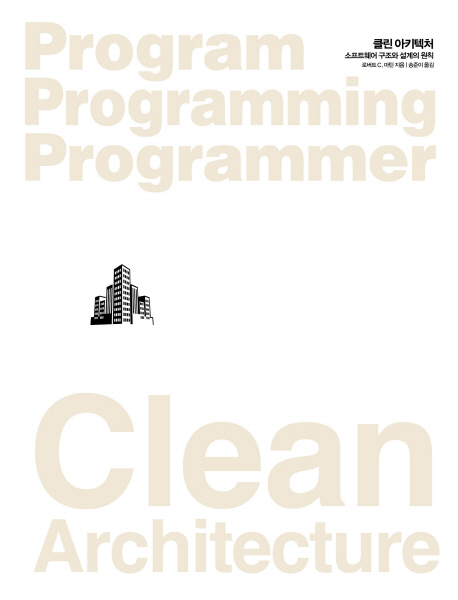

해당 독서후기는 **클린 아키텍쳐 - 소프트웨어 구조와 설계의 원칙**(로버트 C. 마틴 지음 | 송준이 옮김)을 읽고 작성하였습니다.

[출처: 교보문고](http://www.kyobobook.co.kr/product/detailViewKor.laf?ejkGb=KOR&mallGb=KOR&barcode=9788966262472&orderClick=LEa&Kc=#N)

<h2 id="들어가며">
  <a href="#들어가며">
  들어가며
  </a>
</h2>

**클린 아키텍쳐**는 개발자들 사이에서 필독 도서로 꼭 등장하는 책 중 하나입니다.
아키텍쳐라는 개발자에게 있어서는 살면서 꼭 정복해보고 싶은 주제를 다루는 책이니 당연한 일이라고 생각합니다.
게다가 `Uncle Bob`이라고 불리우며 거의 모든 개발자들이 아는 유명한 개발자인 로버트 C. 마틴이 쓴 책이니 두 말하면 입이 아플 지경입니다.

저는 글을 쓰는 이 시점에 현업에서의 개발 경력이 2년에 불과한 주니어 프론트엔드 개발자입니다.
개발을 하며 **[내가 해오던 생각과 그로 인한 설계들](#내가_해오던_생각과_그로_인한_설계들)이 좋은 방향으로 흘러가고 있었는지** 알기 위해서 이 책을 읽었습니다.
~~사실 어떤 책이든 비슷한 목적으로 읽지만 말이죠...~~

이 책을 다 읽는데 2주 반정도의 기간이 걸렸습니다. 실제로 읽은 시간은 10시간 남짓이었던 것 같습니다.
아직 지식도 부족하고 경험도 부족해 책에서 알려주고자 하는 부분 중 굉장히 적은 부분만 이해한 것 같습니다.
그러니 이 글을 읽으시는 분들께서 _주니어 개발자가 노력하는구나_ 정도의 너그러운 마음으로 읽어주시면 감사하겠습니다.

<h2 id="내가_해오던_생각과_그로_인한_설계들">
  <a href="#내가_해오던_생각과_그로_인한_설계들">
  내가 해오던 생각과 그로 인한 설계들
  </a>
</h2>

프론트엔드 개발자로써 2년동안 일해오며 저는 아래와 같은 생각을 가지고, 그 생각을 기반으로 설계하며 개발해왔습니다.
2년 경력의 개발자가 무슨 설계? 라고 하실 수도 있겠지만, 프로젝트 두 개를 주도하며 작은 규모의 설계들을 했습니다.

<h3 id="내가_해오던_생각들">
  <a href="#내가_해오던_생각들">
  내가 해오던 생각들
  </a>
</h3>

* **문제를 적절한 크기의 규모로 나누어 해결하기** 
  문제를 너무 크게 생각하면 복잡해지고, 너무 작게 생각하면 문제와 동떨어지게 된다고 생각합니다.
* **추상화를 너무 섣부르게 하지 않기** 
  개발자들이 강박적으로 가지고 있는 생각과 행동 중 하나는 비슷해보이는 코드를 하나의 코드로 묶어내는 것입니다. 그리고 뿌듯해하는 것입니다.
  하지만 이러한 행동의 결과물인 코드들이 시간이 지나 보면 기능을 추가할수도, 더 이상 재사용할 수도 없어지고, 유지보수가 불가능해 지는 것을 경험하면서
  섣부르게 코드를 묶어내 추상화하는 것을 지양하고 있습니다.
* **문제를 가장 간단하며 적절한 방법으로 해결하기** 
  저를 비롯한 많은 사람들이 자신에게 익숙하단 이유로, 트렌드한 방법이라는 이유로, 해오던 방식이라는 이유로,
   복잡하고 어려운 방법(디자인 패턴, 라이브러리, 프레임워크 등)으로 문제를 해결해 나갑니다.
  하지만 가장 좋은 문제 해결 방법은 문제를 해결할 수 있는 가장 간단하고 적절한 해결 방법이라고 생각합니다.

<h3 id="그로_인한_설계들">
  <a href="#그로_인한_설계들">
  그로 인한 설계들
  </a>
</h3>

* 