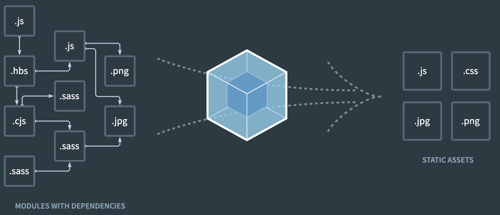

해당 글은 CRA(Create-React-App)의 개발환경을 Webpack과 Babel 등으로 직접 구현하는 과정을 서술합니다. Webpack과 Babel에 친숙해지는 것이 목표입니다.</br>
CRA의 모든 기능을 구현하진 않습니다.

<br>

## CRA란 ?

Facebook에서 만든 React, CSR 환경에서의 프로젝트를 쉽게 시작할 수 있도록 만들어놓은 일종의 Bolierplate입니다.</br>
CRA은 다음과 같은 개발환경 기능들을 제공합니다.

- React, JSX, ES6, TypeScript, Flow의 문법들을 지원합니다. 즉, 해당 문법들을 브라우저가 이해할 수 있는 ES5 이하의 문법들로 변환해줍니다.
  > React, JSX, ES6, TypeScript and Flow syntax support.
- 객체 전개 구문과 같은 ES6 이외의 언어도 지원합니다. 쉽게 말하자면 ES6+의 문법들을 사용할 수 있습니다.
  > Language extras beyond ES6 like the object spread operator.
- CSS를 사용할 때 `-webkit-`과 같은 접두사를 자동적으로 생성해줍니다.
  > Autoprefixed CSS, so you don’t need `-webkit-` or other prefixes.
- 커버리지 리포팅을 제공하는 unit test에 대한 빠른 대화식(?) 러너를 제공합니다.
  > A fast interactive unit test runner with built-in support for coverage reporting.
- 일반적인 실수에 대해 경고를 제공하는 개발서버를 제공합니다.
  > A live development server that warns about common mistakes.
- 해쉬 및 소스맵과 함께 JS, CSS, 이미지들을 production용으로 번들할 수 있는 script를 제공합니다.
  > A build script to bundle JS, CSS, and images for production, with hashes and sourcemaps.
- PWA의 기준을 만족시키는 offline-first service worker와 webb app manifest
  > An offline-first [service worker](https://developers.google.com/web/fundamentals/getting-started/primers/service-workers) and a [web app manifest](https://developers.google.com/web/fundamentals/engage-and-retain/web-app-manifest/), meeting all the [Progressive Web App](https://facebook.github.io/create-react-app/docs/making-a-progressive-web-app) criteria. (_Note: Using the service worker is opt-in as of `react-scripts@2.0.0` and higher_)
- 위 모든 특징을 제공하면서도 단일 종속성으로 업데이트가 간편합니다.
  > Hassle-free updates for the above tools with a single dependency.

<br>

참 많은 기능들을 제공하네요. 이 글에서는 위 기능들 중 다음 기능들을 구현해보도록 하겠습니다. 또한 위 기능들에는 나와있지 않지만, React는 [ES6의 표준 모듈 시스템](https://developer.mozilla.org/en-US/docs/Web/JavaScript/Reference/Statements/import)을 사용합니다. 표준 모듈 시스템을 브라우저는 이해하지 못하기 때문에 표준 모듈 시스템을 번들링해 단일 파일로 만들어주겠습니다.

- 표준 모듈 시스템 -> 단일 파일로 번들링하기
- 발전된 언어들의 문법을 브라우저가 이해할 수 있도록 변환해주기.
  - React, JSX, ES6, TypeScript, Flow의 문법들을 지원합니다. 즉, 해당 문법들을 브라우저가 이해할 수 있는 ES5 이하의 문법들로 변환해줍니다.
  - 객체 전개 구문과 같은 ES6 이외의 언어도 지원합니다. 쉽게 말하자면 ES6+의 문법들을 사용할 수 있습니다.
- 개발서버 구축하기
  - 일반적인 실수에 대해 경고를 제공하는 개발서버를 제공합니다.
- 소스코드를 production용으로 빌드하기
  - 해쉬 및 소스맵과 함께 JS, CSS, 이미지들을 production용으로 번들할 수 있는 script를 제공합니다.

<br>
구현하기 앞서, Webpack과 Babel에 대해 알아보도록 하겠습니다.
<br><br>

## Webpack이란 ?


해당 그림은 [webpack 공식사이트](https://webpack.js.org/)에 나와있는 그림입니다. 사실 이 그림보다 webpack을 더 잘 설명할 수 있는 그림은 없다고 생각합니다. 공식사이트에서 이 그림 위에 `bundle your *`라는 문구가 나옵니다. 이 문구 자체가 webpack이 무엇인지 알려주는 문구입니다.</br>
그림에서 왼쪽에는 다양한 파일들이 있습니다. 여기서 주목해야할 것은 화살표의 시작점입니다. 좌상단에 `.js` 파일로 시작해 `.hbs`, `.js`, `.cjs`, `.png`, .`.sass` ... 등의 파일들로 확장되가는 모습입니다. 그리고 `MODULES WITH DEPENDENCIES`라는 문구가 보입니다. 즉, 모든 파일들은 `MODULE`이고 이 `MODULE`들이 각자를 `DEPENDENCY`로 사용하며 하나의 어플리케이션이 구현된다고 생각하시면 됩니다. 이렇게 모듈 시스템으로 구축된 어플리케이션의 소스코드를 브라우저가 이해할 수 있도록 `BUNDLE`해주는 것이 Webpack의 존재 이유입니다. 브라우저가 모듈 시스템을 이해하지 못하므로 Webpack이 존재하는 것입니다. (Chrome은 버전 61부터 지원한다고 합니다.) 좀 더 자세한 설명은 [why-webpck](https://webpack.js.org/concepts/why-webpack/)을 참고하시면 됩니다.

<br>

## Babel이란 ?

[babel 공식사이트](httpsL://babeljs.io)는 다음과 같이 설명합니다.</br>

> Babel is a JavaScript compiler. </br>
> Use next generation JavaScript, today.

말 그대로 Babel은 JS 컴파일러입니다. [What is Babel](https://babeljs.io/docs/en/)에서는 '바벨은 현재 및 구형 브라우저나 환경이 ES 2015+ (즉, 6+) 코드를 이해할 수 있도록 변환해주는 툴체인이다.'라고 말하고 있습니다.

> Babel is a toolchain that is mainly used to convert ECMAScript 2015+ code into a backwards compatible version of JavaScript in current and older browsers or environments.

<br>

## 표준 모듈 시스템 -> 단일 파일로 번들링하기

다음과 같은 구조로 파일을 생성하고, 파일의 내용을 입력하겠습니다.

```sh
// dir tree
- your project dir
|- src
  |- index.js
  |- math.js
|- index.html
```

```html
<!-- index.html -->
<!DOCTYPE html>
<html lang="en">
  <head>
    <meta charset="UTF-8" />
    <meta name="viewport" content="width=device-width, initial-scale=1.0" />
    <title>Hello Webpack</title>
  </head>
  <body>
    <script type="module" src="./src/index.js"></script>
  </body>
</html>
```

```js
// src/math.js
const math = {
  plus: (numbers) => {
    return numbers.reduce((acc, cur) => acc + cur);
  },
};

export default math;
```

```js
// src/index.js
import math from './math';

console.log(math.plus(Array.from({ length: 10 }, (v, i) => i)));
```

`index.html` 파일을 브라우저로 열면 개발자도구 > console 창에

```text
Access to script at 'file:///Users/parkjunhyeock/Documents/clone-cra-setting/src/index.js' from origin 'null' has been blocked by CORS policy: Cross origin requests are only supported for protocol schemes: http, data, chrome, chrome-extension, https.
```

와 비슷한 에러 문구가 나타납니다. 해당 에러의 이유는 [takeknowledge님의 블로그](https://velog.io/@takeknowledge/%EB%A1%9C%EC%BB%AC%EC%97%90%EC%84%9C-CORS-policy-%EA%B4%80%EB%A0%A8-%EC%97%90%EB%9F%AC%EA%B0%80-%EB%B0%9C%EC%83%9D%ED%95%98%EB%8A%94-%EC%9D%B4%EC%9C%A0-3gk4gyhreu)에서 답을 알 수 있습니다. 간단하게 말하자면 브라우저는 사용자의 파일시스템에 직접적으로 접근하지 못하도록 제한돼있기 때문입니다. 이런 문제도 Webpack을 이용해 단일 파일로 번들링해주면 해결할 수 있습니다.

### 필요한 devDependecies 설치

이제 Webpack을 이용해 파일을 번들링 해보겠습니다.

```sh
// 커맨드
npm init -y
npm i -D webpack webpack-cli
```

```json
// package.json
...
"devDependencies": {
    "webpack": "^4.43.0",
    "webpack-cli": "^3.3.11"
  }
```

필요한 모듈들이 잘 설치됐다면 이제 webpack을 이용해 번들해보겠습니다.

```sh
// 커맨드
npx webpack
// 또는
./node_modules/.bin/webpack
```

해당 커맨드를 입력하면 webpack이 `src/index.js`를 인식해 해당 파일과 파일의 dependency module을 번들링합니다. 결과물로 `dist/main.js` 가 생성된 것을 확인하실 수 있습니다.

```sh
// dir tree
- your project dir
|- dist // webpack 실행시 생성
  |- main.js // webpack 실행시 생성
|- src
  |- index.js
  |- math.js
|- index.html
|- package.json
```

생성된 `dist/main.js`를 사용하는 `dist/index.html`을 생성해주겠습니다.

```html
<!-- dist/index.html -->
<!DOCTYPE html>
<html lang="en">
  <head>
    <meta charset="UTF-8" />
    <meta name="viewport" content="width=device-width, initial-scale=1.0" />
    <title>Hello Webpack</title>
  </head>
  <body>
    <script src="main.js"></script>
  </body>
</html>
```

`dist/index.html`을 브라우저로 실행시키면 개발자도구 > 콘솔창에 `45`가 출력된 것을 확인하실 수 있습니다.

</br>

## 발전된 언어들의 문법을 브라우저가 이해할 수 있도록 변환해주기.

React, JSX, ES6, ES6+, TypeScript 를 사용할 수 있도록 설정해보겠습니다.

### React, JSX, ES6
React와 JSX, ES6문법을 사용하기 위해서는 Babel을 이용해 컴파일을 해 주어야 합니다.<br>

#### Babel 사용에 필요한 모듈
- `@babel/core`
- `@babel/cli`

#### React와 JSX, ES6 컴파일에 필요한 모듈
- `@babel/preset-react`
- `@babel/preset-env`

#### React 사용에 필요한 모듈
- `react`
- `react-dom`

위 모듈들을 모두 설치합니다.
```shell script
// 커맨드
npm i react react-dom
npm i -D @babel/core @babel/cli @babel/preset-react @babel/preset-env
```

<br>

`babel.config.json` 파일을 생성하고 다음과 같이 작성해 Babel에게 해당 preset을 사용한다고 알려줍니다.
```json
// babel.config.json
{
  "presets": ["@babel/preset-env", "@babel/preset-react"]
}
```

<br>

React와 JSX, ES6문법을 Babel이 컴파일해주는지 알아보기 위해 `src/index.js` 를 다음과 같이 `src/index.jsx`로 변경합니다.

```jsx
// src/index.jsx
import ReactDom from 'react-dom'
import React from 'react';
import math from "./math";

console.log(math.plus(Array.from({ length: 10 }, (v, i) => i)));

function App() {
    const [a, b] = ['a', 'b'];
    return <span>{`${a} & ${b}`}</span>
}

ReactDom.render(<App/>, document.getElementById('root'))
```

<br>

이제 Babel을 실행시켜볼 차례입니다. Babel은 보통 Webpack의 loader로 등록하여 함께 Webpack이 `bundle` 과정에서 babel을 실행시키도록 합니다.
loader로 사용할 `babel-loader`를 설치해주고, Webpack의 loader에 Babel을 등록시키기 위해 다음과 같이 커맨드를 실행시키고 `webpack.config.js` 를 생성해줍니다.

```shell script
npm i -D babel-loader
```
```js
const path = require('path');

module.exports = {
    entry: "./src/index.jsx",
    output: {
        path: path.resolve(__dirname, "dist"),
        filename: "index.bundle.js"
    },
    module: {
        rules: [
            {
                test: /\.(js|jsx)$/,
                exclude: /node_modules/,
                use: 'babel-loader',
            }
        ]
    }
}
```

`webpack.config.js` 코드를 살펴보겠습니다.
#### entry
bundle과정을 시작할 파일을 설정하는 곳입니다. 우리는 `./src/index.jsx` 를 시작점으로 설정했습니다.

#### output
bundle된 파일을 어디에 어떤 이름으로 출력할지 설정하는 곳입니다.

#### module
bundle에 사용될 loader를 설정하는 곳입니다. `test` 는 loader를 적용할 file들을 설정하는 곳입니다.
우리는 `.js`와 `.jsx`파일을 타겟으로 설정해줬습니다. `exclude`는 loader를 적용하지 않을 file을 설정하는 곳입니다.
`node_modules`안에 있는 `.js`와 `.jsx`파일들을 loader가 적용되지 않습니다.
`use`는 사용할 loader를 설정하는 곳입니다.

<br>

필요한 모든 모듈을 설치하였고, 설정도 했으니 이제 webpack을 실행시켜 babel이 React, JSX, ES6 문법을 잘 컴파일 해주는지 보겠습니다.

```shell script
// 커맨드
npx webpack --mode development
```

커맨드를 실행시키면 `dist/index.bundle.js` 가 생성됩니다. 해당 스크립트를 브라우저에서 실행시키기 위해 다음과 같은 `dist/index.html` 을 생성해줍니다.

```html
<!doctype html>
<html lang="en">
<head>
    <meta charset="UTF-8">
    <meta name="viewport"
          content="width=device-width, user-scalable=no, initial-scale=1.0, maximum-scale=1.0, minimum-scale=1.0">
    <meta http-equiv="X-UA-Compatible" content="ie=edge">
    <title>Document</title>
</head>
<body>
    <div id="root" />
    <script src="index.bundle.js"></script>
</body>
</html>
```

`dist/index.html` 을 브라우저에서 실행시키면 다음과 같이 실행결과가 나옵니다.


<br>

### ES6+
`Promise`, `WeakMap`, `Array.from`, `Object.assign`과 같은 ES6+문법을 브라우저~~(라고 쓰고 IE라고 읽습니다.)~~에 이해시키기 위해서는 `polyfill`을 추가해줘야합니다.<br>
`polyfill` 을 사용하기 위해서는 `core-js@2` 혹은 `core-js@3` 이 필요합니다. `core-js@2`를 설치하고 `babel.config.json`에 설정해줍니다.

```shell script
// 커맨드
npm i core-js@2
```
```json
// babel.config.json
{
  "presets": [
    [
      "@babel/preset-env",
      {
        "useBuiltIns": "usage",
        "corejs": {
          "version": 2
        }
      }
    ],
    "@babel/preset-react"
  ]
}
```
<br>

### Typescript
```shell script
npm i -D typescript ts-loader @types/react-dom @types/react
```
```json
// tsconfig.json
{
  "compilerOptions": {
    "outDir": "./dist/",
    "noImplicitAny": true,
    "module": "es2020",
    "target": "es2015",
    "jsx": "react",
    "allowJs": true,
    "sourceMap": true,
    "module": "ES6",
    "allowSyntheticDefaultImports": true
  },
  "include": [
    "src/**/*"
  ],
  "exclude": [
    "node_modules/**/*"
  ]
}
```
```js
// webpack.config.js
const path = require('path');

module.exports = {
    entry: "./src/index.tsx",
    output: {
        path: path.resolve(__dirname, "dist"),
        filename: "index.bundle.js"
    },
    resolve: {
        extensions: ['.js', '.ts', '.tsx'],
    },
    module: {
        rules: [
            {
                test: /\.(ts|tsx)$/,
                exclude: /node_modules/,
                use: 'ts-loader',
            }
        ]
    }
}
```
```tsx
// src/index.tsx
import ReactDom from 'react-dom'
import React from 'react';
import math from "./math";

console.log(math.plus(Array.from({ length: 10 }, (v, i) => i)));

function renderArgsAfter1Min(...args: string[] | number[]) {
    return new Promise<void>((resolve, reject) => {
        try {
            setTimeout(() => {
                resolve(console.log(args))
            }, 2000)
        } catch (e) {
            reject(e)
        }
    })
}

function App() {
    const [a, b] = ['a', 'b'];
    renderArgsAfter1Min('2초후에 나타납니다.')
    return <div>{`${a} & ${b}`}</div>
}

ReactDom.render(<App/>, document.getElementById('root'))
```
```ts
// src/math.ts
const math = {
  plus: (numbers: number[]) => {
    return numbers.reduce((acc, cur) => acc + cur);
  },
};

export default math;
```

<br>

## 개발서버 구축하기
```shell script
npm i -D webpack-dev-server html-webpack-plugin
```
```js
// webpack.config.js
const path = require('path');
const HtmlWebpackPlugin = require('html-webpack-plugin');

module.exports = {
    entry: "./src/index.tsx",
    output: {
        path: path.resolve(__dirname, "dist"),
        filename: "index.bundle.js"
    },
    resolve: {
        extensions: ['.js', '.ts', '.tsx'],
    },
    module: {
        rules: [
            {
                test: /\.(ts|tsx)$/,
                exclude: /node_modules/,
                use: 'ts-loader',
            }
        ]
    },
    plugins: [
        new HtmlWebpackPlugin({
            template: "./index.html"
        })
    ]
}
```
```html
<!-- index.html -->
<!DOCTYPE html>
<html lang="en">
  <head>
    <meta charset="UTF-8" />
    <meta name="viewport" content="width=device-width, initial-scale=1.0" />
    <title>Hello Webpack</title>
  </head>
  <body>
    <div id="root"></div>
  </body>
</html>
```
```shell script
npx webpack-dev-server
```

- 참조
    - [김정환님의프론트엔드 개발환경의 이해와 실습](https://www.inflearn.com/course/%ED%94%84%EB%A1%A0%ED%8A%B8%EC%97%94%EB%93%9C-%EA%B0%9C%EB%B0%9C%ED%99%98%EA%B2%BD)
    - [Babel 공식페이지](https://babeljs.io/)
    - [Webpack 공식페이지](https://webpack.js.org/)
    - [CRA 공식페이지](https://create-react-app.dev/)