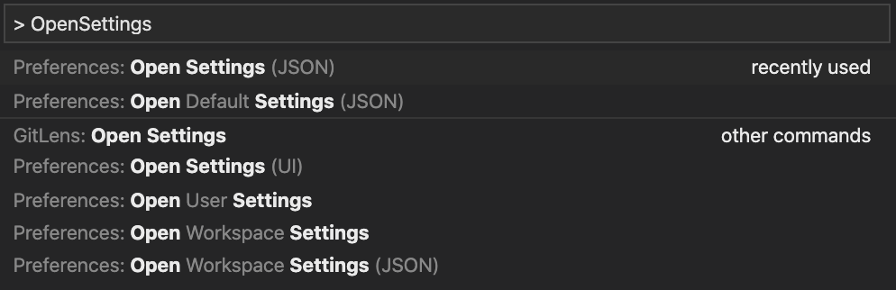

해당 글에서는 ESLint와 Prettier가 무엇인지, 왜 필요한지 알아보고, 사용법을 익힌 후, 프로젝트에 어떻게 적용하는지 알아보겠습니다.

## ESLint란?

[ESLint의 공식사이트](https://eslint.org/)에서는 ESLint를 다음과 같이 소개합니다. </br>

### ESLint

당신의 JavsScript code의 문제를 찾고 고칩니다.

> Find and fix problems in your JavaScript code

- Find Problems </br>
  ESLint는 코드를 정적으로 분석하여 신속하게 문제를 찾습니다. ESLint는 대부분의 텍스트 편집기에 내장되어 있으며 지속적인 통합 파이프 라인의 일부로 ESLint를 실행할 수 있습니다.
  > ESLint statically analyzes your code to quickly find problems. ESLint is built into most text editors and you can run ESLint as part of your continuous integration pipeline.
- Fix Automatically </br>
  ESLint가 찾은 많은 문제는 자동으로 수정 될 수 있습니다. ESLint 픽스는 구문을 인식하므로 기존의 찾기 및 바꾸기 알고리즘으로 인한 오류가 발생하지 않습니다.
  > Many problems ESLint finds can be automatically fixed. ESLint fixes are syntax-aware so you won't experience errors introduced by traditional find-and-replace algorithms.
- Customize </br>
  코드를 사전 처리하고, 사용자 정의 파서를 사용하며, ESLint의 내장 규칙과 함께 작동하는 고유 한 규칙을 작성하십시오. ESLint를 프로젝트에 필요한 방식으로 정확하게 작동하도록 사용자 정의 할 수 있습니다.
  > Preprocess code, use custom parsers, and write your own rules that work alongside ESLint's built-in rules. You can customize ESLint to work exactly the way you need it for your project.

</br>

정리해보자면 ESLint는

1. 우리가 작성한 코드를 분석하여 문제를 찾고
2. 그 문제를 해결할 수 있도록 자동으로 코드를 고쳐주는 역할을 합니다.

또한, 코드에서 문제를 찾을 때 ESLint의 내장 규칙뿐만 아니라 사용자의 커스터마이즈한 규칙도 함께 적용시킬 수 있습니다.</br>
이로 인해 우리의 코드 퀄리티는 향상되고, 버그를 줄일 수 있습니다.</br>
참고로 ESLint라는 이름은 ES + Lint로, ES는 [ECMAScript](https://ko.wikipedia.org/wiki/ECMA%EC%8A%A4%ED%81%AC%EB%A6%BD%ED%8A%B8)의 줄임말이고, [Lint](<https://ko.wikipedia.org/wiki/%EB%A6%B0%ED%8A%B8_(%EC%86%8C%ED%94%84%ED%8A%B8%EC%9B%A8%EC%96%B4)>)는 소스 코드를 분석하여 프로그램 오류, 버그, 스타일 오류, 의심스러운 구조체에 표시를 달아놓기 위한 도구들을 가리킵니다.

</br>

## Prettier란?

[Prettier의 공식사이트](https://prettier.io/)에서는 Prettier를 다음과 같이 소개합니다.</br>

### What is Prettier

- 완고한 코드 포맷터</br>
  Prettier 자체적인 Style Guide가 있고, 해당 Guide에 따라 코드를 포맷팅해주므로 이러한 표현을 쓴 듯 싶습니다.</br>
  ~~(맞는지는 잘 모르겠네요...)~~
  > An opinionated code formatter
- 많은 언어들을 지원
  > Supports many languages
- 대부분의 에디터들과 통합
  > Integrates with most editors
- 몇 가지 옵션들
  > Has few options

### Why

- 저장시 코드에 포맷이 적용됩니다.
  > You press save and code is formatted
- 코드 리뷰에서 코드 스타일에 관해서 의논할 필요가 사라집니다.
  > No need to discuss style in code review
- 코드 포맷팅에 당신의 시간과 에너지를 뺏기지 마세요.
  > Saves you time and energy
- [And more](https://prettier.io/docs/en/why-prettier.html)

And More 페이지에 들어가보시면 `Building and enforcing a style guide`라는 문구가 우리를 반겨줍니다. 말 그대로 코드 style guide를 구축하고 해당 guide를 따르도록 강제하라는 말입니다.

</br>

## 왜 필요할까 ?

ESLint와 Prettier의 소개를 잘 읽어보니 왜 필요한지 느낌이 옵니다. ESLint를 사용하여 ES의 규칙에 따라 코드를 작성하고, Prettier를 사용하여 코드의 Style Guide를 구축하고 해당 guide를 따르도록 합니다.</br>
우리는 이를 통해 ES의 규칙을 따르는 훌륭한 코드를 작성할 수 있고, 이에 따라 버그율을 현저히 낮출 수 있습니다. 또한 코드 Style Guide를 강제함으로써 코드의 일관성을 유지할 수 있습니다.

</br>

## ESLint 사용법

- 환경
  ```sh
  Node v12.13.0
  npm v6.12.1
  ```

우선 특정 디렉토리 안에 새로운 npm 프로젝트를 생성합니다.</br>
저는 `eslint-prettier`라는 디렉토리안에 npm프로젝트를 생성하도록 하겠습니다.

```sh
// 커맨드
npm init -y
```

</br>

해당 커맨드를 실행 시 ``package.json`` 파일이 생성됩니다.</br>
eslint와 prettier를 적용할 코드를 작성하기위해 ``app.js``를 생성해줍니다.
``app.js``안에 다음과 같은 코드를 작성하겠습니다.

```js
// app.js
const helloEslint='eslint'
const helloPrettier=''

function someFn(arg){if(arg)console.log(arg)};;;

someFn(helloEslint)
```
해당 코드는 세미콜론이 없기도 하고, 필요 없는 세미콜론이 많이 붙여져있기도 하며, 가독성도 현저히 떨어지게 작성돼있습니다. 해당 코드에 ESLint를 적용시켜봅시다. 그러기 위해 ESLint를 devDependencies로 설치해주겠습니다. 그리고 eslint의 --init 명령어를 사용하여 eslint config파일을 생성해줍니다.

```sh
// 커맨드
npm i -D eslint
npx eslint --init
```
``npx eslint --init``을 실행하면 나오는 옵션선택은 아래와 같이 해주시면 됩니다.
- To check syntax and find problems
- JavaScript modules (import/export) 
- None of these 
- TypeScript 사용 No
- Browser
- Javascript

그럼 아래와 같은 ``.eslintrc.js``가 생성됩니다.
```js
// .eslintrc.js
module.exports = {
    "env": {
        "browser": true,
        "es6": true
    },
    "extends": "eslint:recommended",
    "globals": {
        "Atomics": "readonly",
        "SharedArrayBuffer": "readonly"
    },
    "parserOptions": {
        "ecmaVersion": 2018,
        "sourceType": "module"
    },
    "rules": {
    }
};
```
이제 eslint를 사용해 우리의 app.js를 검사해보겠습니다.
```sh
// 커맨드
npx eslint app.js
```
그럼 다음과 같은 메세지가 나옵니다.
```sh
  2:7   error  'helloPrettier' is assigned a value but never used  no-unused-vars
  4:46  error  Unnecessary semicolon                               no-extra-semi
  4:47  error  Unnecessary semicolon                               no-extra-semi
  4:48  error  Unnecessary semicolon                               no-extra-semi

✖ 4 problems (4 errors, 0 warnings)
  3 errors and 0 warnings potentially fixable with the `--fix` option.
```
``helloPrettier``라는 변수가 선언만 돼있고, 사용되지 않는다는 ``no-unused-vars`` 에러 메세지와 불필요한 세미콜론을 사용하고 있다는 ``no-extra-semi``라는 에러메세지가 나옵니다. </br>
이제 eslint를 사용하여 해당 에러들은 고쳐보도록 하겠습니다. 방법은 위 메세지에 친절하게 ``--fix`` 옵션을 사용하라고 나와있습니다.
```sh
// 커맨드
npx eslint app.js --fix
```
해당 커맨드를 실행시키면 app.js는 아래와 같이 수정되고, 메세지가 출력됩니다.
```js
// app.js
const helloEslint='eslint'
const helloPrettier=''

function someFn(arg){if(arg)console.log(arg)}

someFn(helloEslint)
```
```sh
   2:7  error  'helloPrettier' is assigned a value but never used  no-unused-vars

✖ 1 problem (1 error, 0 warnings)
```
``no-extra-semi``는 eslint가 자동으로 해결해줬지만 ``no-unused-vars``는 자동으로 해결해주지 않습니다. 위처럼 모든 에러를 eslint가 자동으로 해결해줄 수 있는것은 아닙니다.

</br>

## Prettier 사용법
이제 Prettier 사용법을 알아봅시다.</br>
eslint 사용법을 익힐때 썼던 프로젝트를 그대로 활용하겠습니다.</br>
해당 커맨드로 prettier를 devDependencies로 설치하고, app.js에 prettier를 적용해보겠습니다.
```sh
// 커맨드
npm i -D prettier
npx prettier app.js
```
해당 커맨드를 실행하시면 아래와 같은 메세지가 출력됩니다.
```sh
const helloEslint = "eslint";
const helloPrettier = "";

function someFn(arg) {
  if (arg) console.log(arg);
}

someFn(helloEslint);
```
app.js에 prettier를 적용시 메세지와 같이 포맷팅된다는 뜻입니다. 하지만 아직 app.js는 그대로일 것입니다. prettier로 app.js의 코드 자체를 포맷팅 시키기 위해서는 ``--write``옵션을 사용하면 됩니다.
```sh
// 커맨드
npx prettier app.js --write
```
해당 커맨드를 사용하면 app.js가 아래와 같이 변경됩니다.
```js
// app.js
const helloEslint = "eslint";
const helloPrettier = "";

function someFn(arg) {
  if (arg) console.log(arg);
}

someFn(helloEslint);
```
이제 코드의 가독성이 훨씬 올라갔습니다. 행복하네요 :) 

</br>

## ESLint와 Prettier 같이 사용하기
지금쯤 그런 생각이 드실겁니다. 그럼 새로운 코드를 작성할때마다 eslint와 prettier를 각각 적용해줘야 하는건가? 라고 말이죠. 그런데 이건 너무 비효율적이고 귀찮습니다. 이 비효율성과 귀찮음을 해결하기위해 eslint에게 prettier의 코드 포맷팅 규칙을 알려주고 eslint만 적용하면 eslint와 prettier의 규칙이 코드에 적용되게 하겠습니다.</br>
해당 커맨드로 ``eslint-config-prettier``와 ``eslint-plugin-prettier``를 devDependencies로 설치해줍니다.
```sh
// 커맨드
npm i -D eslint-config-prettier eslint-plugin-prettier
```
``.eslintrc.js``의 ``extends``에 ``plugin:prettier/recommended``를 추가해줍니다.
```js
// .eslintrc.js
module.exports = {
    ...
    "extends": ["eslint:recommended", "plugin:prettier/recommended"],
    ...
};
```
eslint가 prettier의 코드 포매팅 규칙을 잘 배웠는지 확인하기 위해 ``app.js`` 파일을 다시 예전으로 돌려줍니다.
```js
// app.js
const helloEslint='eslint'
const helloPrettier=''

function someFn(arg){if(arg)console.log(arg)};;;

someFn(helloEslint)
```
``app.js``를 이쁘게 만들어주기 위해 해당 커맨드를 실행시킵니다.
```sh
npx eslint app.js --fix
```
커맨드를 실행시키면 ``app.js``의 코드는 아래와 같이 변경되고 다음과 같은 메세지가 출력됩니다.
```js
const helloEslint = "eslint";
const helloPrettier = "";

function someFn(arg) {
  if (arg) console.log(arg);
}

someFn(helloEslint);
```
```sh
  2:7  error  'helloPrettier' is assigned a value but never used  no-unused-vars

✖ 1 problem (1 error, 0 warnings)
```
우리는 eslint만 app.js에 적용시켰을 뿐인데 prettier를 적용시킨것과 같은 효과가 일어났습니다. eslint가 prettier의 코드 포맷팅 규칙을 잘 배웠네요.

</br>

## VSCode에서 저장시 ESLint 적용시키기
지금쯤 또 이런 생각이 드실 수 있습니다. 아... eslint 명령어도 실행시키기 귀찮은데... 라고 말이죠. 그런 여러분을 위해 VSCode는 코드를 저장할때마다 ESLint를 적용시킬 수 있는 기능을 제공합니다.</br>
우선 Cmd+Shift+X (윈도우는 Ctrl+Shift+X) 를 눌러 VSCode의 EXTENSIONS 탭을 엽니다. ESLint를 검색해서 설치합니다. 설치 후 Cmd+P를 누르고, ``> Open Settings``를 입력하고 ``Open Settings (JSON)``을 선택해 ``settings.json``파일을 열어줍니다.

``settings.json``파일에 아래와 같이 입력해주세요.
```json
{
  "editor.codeActionsOnSave": {
    "source.fixAll.eslint": true
  },
}
```
이제 ``app.js``를 예전과 같이 못생기게 바꾼 후, 저장하시면 코드가 eslint와 prettier가 모두 적용된 스타일로 바뀝니다. 인생이 더 행복해졌네요 :) 

</br>

- 참조
  - [김정환님의 프론트엔드 개발환경의 이해와 실습](https://www.inflearn.com/course/%ED%94%84%EB%A1%A0%ED%8A%B8%EC%97%94%EB%93%9C-%EA%B0%9C%EB%B0%9C%ED%99%98%EA%B2%BD)
  - [ESLint 공식페이지](https://eslint.org/)
      - [Getting Started](https://eslint.org/docs/user-guide/getting-started)
  - [Prettier 공식페이지](https://prettier.io/)
      - [Why Prettier](https://prettier.io/docs/en/why-prettier.html)
      - [Install](https://prettier.io/docs/en/install.html)
      - [ESLint에 통합하기](https://prettier.io/docs/en/integrating-with-linters.html#use-eslint-to-run-prettier)
  - [린트 위키백과](https://ko.wikipedia.org/wiki/%EB%A6%B0%ED%8A%B8_(%EC%86%8C%ED%94%84%ED%8A%B8%EC%9B%A8%EC%96%B4))
  - [ECMA스크립트 위키백과](https://ko.wikipedia.org/wiki/ECMA%EC%8A%A4%ED%81%AC%EB%A6%BD%ED%8A%B8)